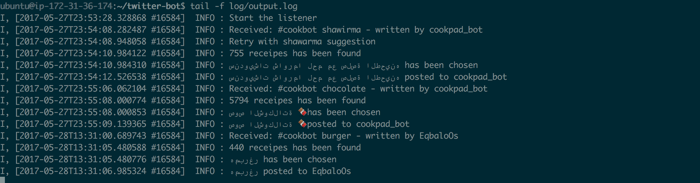
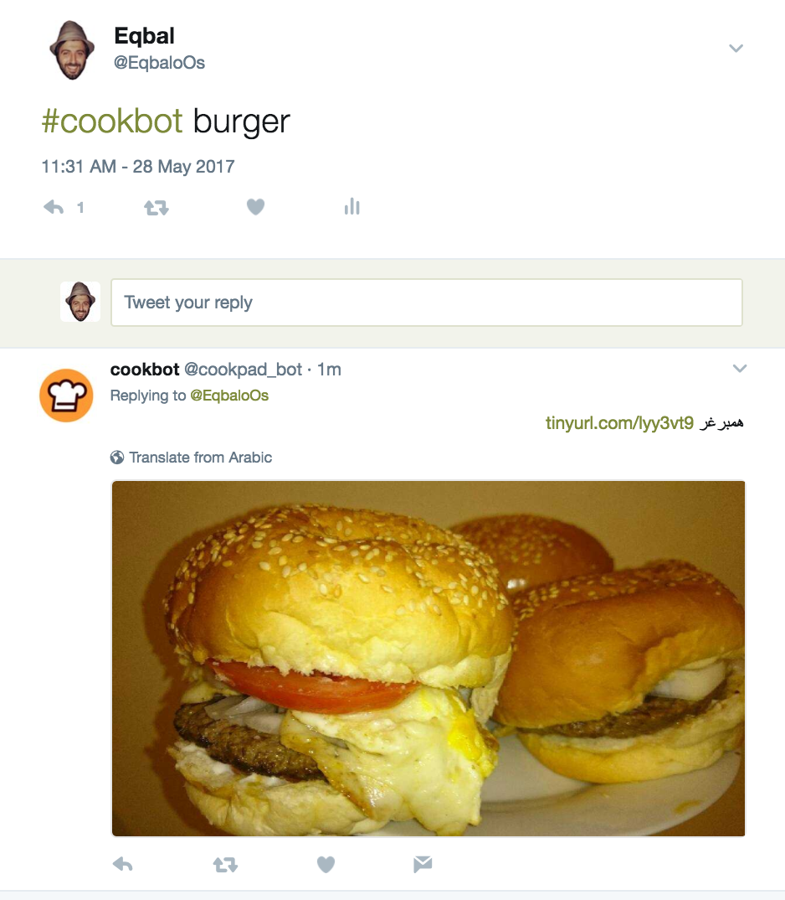

## Cookbot

Experimental Twitter Bot for Cookpad.

### Usage

- Create `.env` file: 

```
consumer_key=[Twitter Consumer Key]
consumer_secret=[Twitter Secret Key]
access_token=[Twitter Access Token]
access_token_secret=[Twitter Access Secret]
cookpad_staging_token=[Cookpad token]
cookpad_staging_recipes_url=https://globalweb-api-staging.ckpd.co/v1/recipes
cookpad_related_searches_staging_url=https://globalweb-api-staging.ckpd.co/v1/related_searches
cookpad_bot_name=cookbot
```
- `bundle exec ./bin/twitter-bot`

### Why

Twitter has 800 million monthly active users – more than 100 times the number of iPhone owners when Apple launched the App Store. Customers today like being able to do things without having to ask or answer a lot of questions during the process. Cookbot will offer our consumers a painless, self-service option that will leave them with a positive view (hopefully). This positive experience is essential to building long lasting relationships with our audience and get new registered users.

Many consumers use phone calls as a last resort to find a solution to their problem, so offering them “self-service” options across mediums they feel more comfortable using will leave a long lasting impression. Happy customers, leave good reviews and refer brands to friends. Making sure they can achieve their end goal on their own terms is sure to improve our customer’s perception of our brand.

### Limitations

- Concurrency since we have blocking I/Os. For now since this is a proof of concept I didn't bother with using actor model (with something like `celluloid` gem) or event processing (with something like `EventMachine`).

- Localization (for now I'm using country-code=LB and provider_id=9) so the results more MENA region oriented (this can be changed later on).

- Results and links point to the staging environment for now.

- Not much sentence extraction for the meaning now (ML can be applied here to know the sentence meaning)

### Workflow:

- Normalize the tweet text
- Try to find recipes using ElasticSearch search end-point.
- If we couldn't find results we will check suggested words and use it again for the search.
- If we find many results we pick one image randomly (Array#sample).
- We shorten the URL and embed the main image of the recipe along with the title and the shorten URL.
- If we get no results and no suggestions then we reply to the tweet that we couldn't find results

### How to test it out
Use `#cookbot` with the name of the recipe you are looking for. ex: `#cookbot homos`. You should receive a reply to your tweet with the image of the random recipe picked and with a short link to the original recipe page (for now we are using staging env)

### Screenshots


